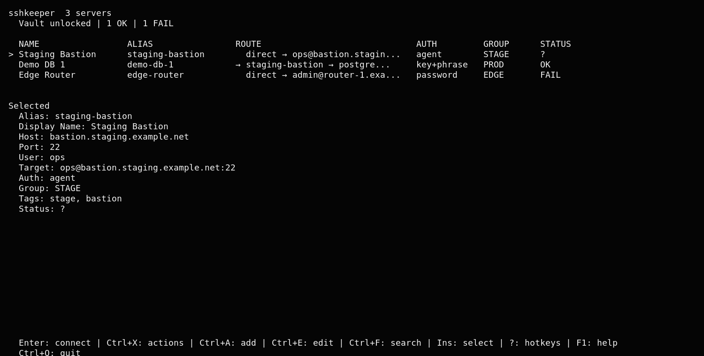
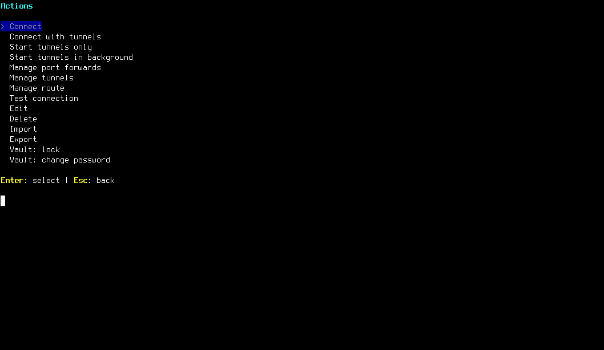
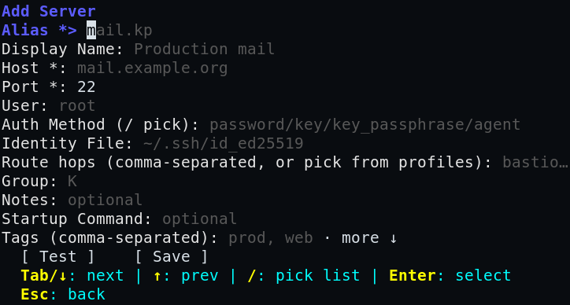
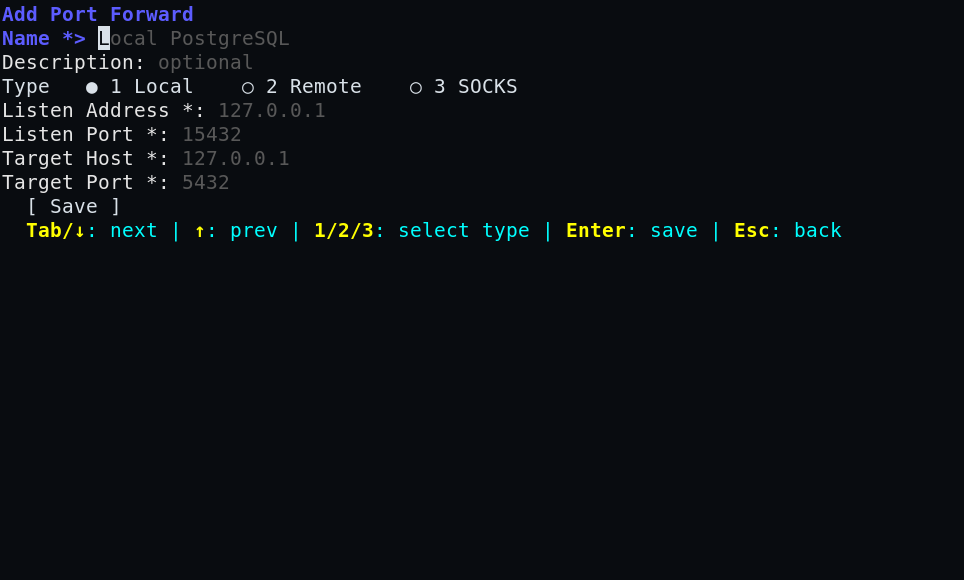
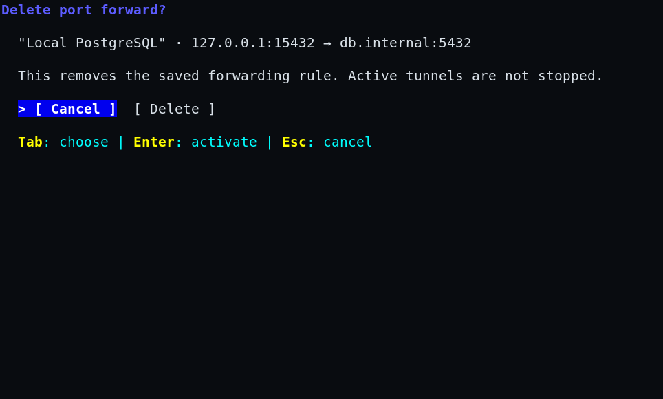

# sshkeeper — Руководство пользователя

## Содержание

1. [Что такое sshkeeper](#что-такое-sshkeeper)
2. [Установка](#установка)
3. [Первый запуск](#первый-запуск)
4. [TUI — основной интерфейс](#tui--основной-интерфейс)
5. [Управление серверами](#управление-серверами)
6. [Маршруты и бастионы](#маршруты-и-бастионы)
7. [Port Forwards и Tunnels](#port-forwards-и-tunnels)
8. [CLI команды](#cli-команды)
9. [Vault — хранилище секретов](#vault--хранилище-секретов)
10. [Сценарии использования](#сценарии-использования)
11. [Справка по клавишам](#справка-по-клавишам)

---

## Что такое sshkeeper

sshkeeper — это консольный менеджер SSH-подключений. Основные релизные платформы — Linux и macOS; Windows-сборка пока экспериментальная. Он хранит профили серверов, секреты (пароли, фразы от ключей) и запускает системный `ssh` с нужными опциями.

**Чем sshkeeper НЕ является:**
- Это не Ansible — он не настраивает серверы и не пушит файлы
- Это не замена SSH — он использует системный `/usr/bin/ssh`

**Что он делает:**
- Хранит профили серверов в локальной SQLite-базе
- Хранит пароли в зашифрованном vault (XChaCha20-Poly1305)
- Управляет маршрутами (бастионы, цепочки прыжков)
- Управляет port forwards (локальные, удалённые, SOCKS)
- Запускает туннели в фоне с отслеживанием PID
- Предоставляет TUI (текстовый интерфейс) и CLI

**Стек технологий:**
- Go 1.25+
- Bubble Tea (TUI framework)
- Cobra (CLI framework)
- SQLite (modernc.org/sqlite)
- XChaCha20-Poly1305 (шифрование vault)
- Argon2id (KDF для мастер-пароля)

**Исходники:**
- Основной публичный репозиторий: [github.com/mirivlad/sshkeeper](https://github.com/mirivlad/sshkeeper)
- Self-hosted зеркало: `git@git.mirv.top:mirivlad/sshkeeper`

---

## Установка

### Из исходников (основной способ)

```bash
git clone git@github.com:mirivlad/sshkeeper.git
cd sshkeeper
go build -o ~/.local/bin/sshkeeper .
```

Или через скрипт:

```bash
./build.sh          # сборка в bin/
./release.sh        # сборка релизных архивов в dist/
```

**Требования:** Go 1.25+ и системный OpenSSH.

Статус платформ:

| Платформа | Статус | Примечание |
|-----------|--------|------------|
| Linux | Основная релизная платформа | Архивы `linux/amd64` и `linux/arm64`. |
| macOS | Основная релизная платформа | Архивы `darwin/amd64` и `darwin/arm64`, нужен системный `ssh`. Homebrew formula запланирована. |
| Windows | Experimental | Нужен OpenSSH Client как `ssh.exe` в `PATH`; password/key-passphrase PTY-сценарии на Windows пока не подтверждены. |

На Windows OpenSSH Client можно установить через Windows Optional Features или PowerShell:

```powershell
Add-WindowsCapability -Online -Name OpenSSH.Client~~~~0.0.1.0
```

### Из релиза (после публикации v0.2.0)

```bash
tar -xzf sshkeeper_v0.2.0_linux_amd64.tar.gz
sudo install -m 0755 sshkeeper_v0.2.0_linux_amd64/sshkeeper /usr/local/bin/sshkeeper
```

---

## Первый запуск

При первом запуске sshkeeper создаёт конфигурацию, базу данных и vault:

```bash
sshkeeper
```

Вы увидите приветствие и запрос на создание мастер-пароля:

```
Welcome to sshkeeper!
No vault found. Let's create one.

Create master password: ********
Repeat master password: ********

Vault created and unlocked for this command. You're ready to go!
```

**Важно:** запомните мастер-пароль. Без него секреты не восстановить.

После создания vault откроется главный экран TUI со списком серверов (пока пустым).

---

## TUI — основной интерфейс

Запуск TUI — просто `sshkeeper` без аргументов.

### Главный экран

```
sshkeeper / Servers                                  Vault unlocked · 1 profiles
────────────────────────────────────────────────────────────────────────────────
┌──────────────────────────────────────────────────────────────────────────────┐
│1 servers                                                                     │
│   NAME                                          AUTH       GROUP      STATUS │
│>  Production                                    agent      -          ?      │
└──────────────────────────────────────────────────────────────────────────────┘
Selected profile
Alias: prod  Target: ops@prod.example:22
Auth: agent  Group: -  Status: ?
```

Интерфейс адаптируется к ширине терминала:

- от 100 столбцов список и подробности выбранного профиля показаны в двух панелях;
- от 70 до 99 столбцов подробности переносятся под список;
- от 60 до 69 столбцов остаётся компактная таблица без второстепенных полей;
- минимальный поддерживаемый размер — `60x16`; ниже показывается сообщение о необходимом размере.

Статус vault в заголовке отражает реальное состояние. Выбор и фокус всегда
обозначены текстовым маркером `>`, поэтому интерфейс остаётся понятным без цвета.





**Столбцы:**

| Столбец | Описание |
|---------|----------|
| NAME | Отображаемое имя сервера |
| ALIAS | Уникальный идентификатор |
| ROUTE | Маршрут подключения (● direct, → via, ⇒ chain) |
| AUTH | Метод аутентификации (key/password/agent/key+phrase) |
| GROUP | Группа сервера |
| STATUS | Результат последнего теста (OK/FAIL/?) |

**Навигация:**

| Клавиша | Действие |
|---------|----------|
| `↑/↓` | Перемещение по списку |
| `Enter` | Подключиться к серверу |
| `Ctrl+A` | Добавить сервер |
| `Ctrl+E` | Редактировать сервер |
| `Ctrl+X` | Меню действий |
| `Ctrl+F` | Поиск |
| `Ins` | Выбрать/снять выбор |
| `?` | Краткая справка по клавишам |
| `F1` | Полная справка по приложению |
| `Ctrl+Q` | Выход |

`Ctrl+Q` работает глобально. Если активная форма содержит несохранённые
изменения, сначала открывается безопасное подтверждение с выбранным Cancel.

### Быстрая справка по клавишам

Нажмите `?` на экране списка или менеджера. В текстовом поле символ `?`
остаётся обычным вводом. `F1` открывает полную справку также из форм.

```
sshkeeper — Quick Help

  Navigation
  ↑/↓             Move through list
  PgUp/PgDn       Scroll page
  Home/End        Jump to start/end

  Actions
  Enter           Select / Confirm / Open
  Esc             Back / Cancel / Close
  Tab / ↓         Next field
  Shift+Tab / ↑   Previous field
  /               Open dropdown picker

  Server list
  Enter           Connect to server
  Ctrl+A          Add server
  Ctrl+E          Edit server
  Ctrl+F          Search
  Ctrl+X          Action menu
  Ins             Select / deselect

  Port forwards
  Ctrl+A          Add forward
  Enter / Ctrl+E  Edit forward
  Ctrl+D          Delete forward

  Other
  ?               This quick help
  F1              Full documentation

  Esc / Enter / ? / q — close
```

### Полная справка по приложению

Нажмите `F1` на любом экране. Это полная документация по sshkeeper:

```
sshkeeper — Full Help

  What is sshkeeper
  sshkeeper is a console SSH connection manager.
  Linux and macOS are primary release targets; Windows is experimental.
  It stores server profiles, secrets, and launches the system ssh client.

  Navigation
  ↑/↓             Move through list
  Tab/↓           Next field
  Shift+Tab/↑     Previous field
  /               Open dropdown picker

  Global actions
  Enter           Select / Confirm / Open
  Esc             Back / Cancel / Close
  ?               Quick help (hotkeys)
  F1              Full documentation
  Ctrl+Q          Quit

  Server list
  Enter           Connect to server
  Ctrl+A          Add server
  Ctrl+E          Edit server
  Ctrl+F          Search
  Ctrl+X          Action menu
  Ins             Select / deselect

  ...

  ↑/↓ scroll — q/Esc/Enter close
```

**Навигация по полной справке:**

| Клавиша | Действие |
|---------|----------|
| `↑/↓` | Прокрутка |
| `PgUp/PgDn` | Прокрутка по странице |
| `q` / `Esc` / `Enter` | Закрыть справку |

---

## Управление серверами

### Добавление сервера

1. Нажмите `Ctrl+A` на главном экране
2. Заполните поля:

```
Add Server

  Alias *:            mail.kp
  Display Name:       Production mail
  Host *:             mail.example.org
  Port *:             22
  User:               root
  Auth Method:        key
  Identity File:      ~/.ssh/id_ed25519
  Route hops:         bastion
  Group:              KP
  Notes:              Main mail server
  Startup Command:    tmux attach -t ops
  Tags:               prod, mail

  [ Test ]  [ Save ]

  Tab/↓: next | ↑: prev | /: pick list | Enter: select | Esc: back
```

Поля с `*` обязательны. Порты принимают только десятичные значения от `1` до
`65535`; ошибочный текст остаётся в поле рядом с понятным сообщением. На
маленьком экране форма показывает окно полей вокруг текущего фокуса, сохраняя
кнопки и подсказку видимыми.



**Навигация по форме:**

| Клавиша | Действие |
|---------|----------|
| `Tab` или `↓` | Следующее поле |
| `Shift+Tab` или `↑` | Предыдущее поле |
| `/` на Auth Method | Выбрать из списка (password/key/key_passphrase/agent) |
| `/` на Group | Выбрать из существующих групп |
| `Enter` на Test | Проверить подключение |
| `Enter` на Save | Сохранить |
| `Esc` | Назад; при изменённых данных сначала запросить подтверждение сброса |

### Редактирование сервера

1. Выберите сервер стрелками
2. Нажмите `Ctrl+E`
3. Отредактируйте поля
4. Нажмите `Enter` на Save

### Удаление сервера

1. Выберите сервер стрелками
2. Нажмите `Ctrl+X` (меню действий)
3. Выберите "Delete"
4. Диалог по умолчанию выделяет **Cancel**. Нажмите `Tab`, затем `Enter`, чтобы удалить; `Esc` отменяет операцию. Быстрые клавиши `Y`/`N` также поддерживаются.

Диалог называет точный профиль и предупреждает, что вместе с ним удаляются
сохранённые forwards и секреты vault.

### Тест подключения

1. Выберите сервер стрелками
2. Нажмите `Ctrl+X` → "Test connection"
3. Результат отобразится в столбце STATUS (OK/FAIL)

### Поиск

1. Нажмите `Ctrl+F`
2. Введите запрос (поиск по alias, name, host, user, group, notes, tags, route hops, forward ports)
3. `Enter` — применить фильтр
4. `Esc` — сбросить

---

## Маршруты и бастионы

### Прямое подключение

Сервер подключается напрямую:

```
ROUTE:   ● direct → root@web.example.org:22
```

### Через бастион

Сервер доступен через один jump host:

```
ROUTE:   → bastion → root@internal.web:22
```

### Цепочка прыжков

Сервер доступен через несколько jump hosts:

```
ROUTE:   ⇒ bastion → dmz-gw → … → root@secure.internal:22
```

### Настройка маршрута

**Через TUI:**
1. Добавьте/редактируйте сервер или выберите `Ctrl+X` → "Manage route"
2. В поле "Route hops" введите бастионы через запятую: `bastion,dmz-gw`
3. Или введите адрес напрямую: `user@bastion.example.com:2222`

**Через CLI:**

```bash
sshkeeper route set web --jumps bastion
sshkeeper route set prod --jumps bastion,dmz-gw
sshkeeper route show web
sshkeeper route clear web
```

---

## Port Forwards и Tunnels

### Ключевое различие

- **Port Forward** — сохранённое правило проброса порта. Просто конфигурация, не запускает процесс.
- **Tunnel** — запущенный SSH-процесс, который активирует один или несколько forwards.

Аналогия: forward — это рецепт, tunnel — это готовое блюдо.

### Типы forwards

| Тип | Описание | Пример |
|-----|----------|--------|
| **Local** | Порт на вашей машине → сервис за SSH-сервером | Локальный 5432 → удалённый PostgreSQL |
| **Remote** | Порт на SSH-сервере → сервис на вашей машине | Удалённый 8080 → локальный dev-сервер |
| **SOCKS** | Локальный SOCKS-прокси через SSH | Браузер → SOCKS → интернет через SSH-сервер |

### Управление forwards через TUI

1. Выберите сервер на главном экране
2. Нажмите `Ctrl+X` → "Manage port forwards"
3. Откроется список forwards:

```
Port Forwards — web

  NAME                 TYPE    LISTEN               TARGET               ON
> Local PostgreSQL     local   127.0.0.1:15432      127.0.0.1:5432       yes

Selected
  Port 127.0.0.1:15432 on this machine will be forwarded through web to 127.0.0.1:5432.
  ssh -L 127.0.0.1:15432:127.0.0.1:5432

  Ctrl+A: add | Ctrl+E/Enter: edit | Ctrl+D: delete | Esc: back
```

Строки и пояснение выбранного forward сокращаются по экранным ячейкам, а не
по байтам, поэтому кириллица, CJK и emoji не ломают границы таблицы.

**Действия:**

| Клавиша | Действие |
|---------|----------|
| `Ctrl+A` | Добавить forward |
| `Enter` или `Ctrl+E` | Редактировать выбранный |
| `Ctrl+D` | Удалить (с подтверждением) |
| `Esc` | Назад |

### Добавление forward

1. Нажмите `Ctrl+A` на экране forwards
2. Выберите тип (1/2/3 или Tab):

```
Add Port Forward

  Name *:             Local PostgreSQL
  Description:        optional

  Type  ● 1 Local   ○ 2 Remote   ○ 3 SOCKS

  Listen Address *:   127.0.0.1
  Listen Port *:      15432
  Target Host *:      127.0.0.1
  Target Port *:      5432

  Preview
  -L 127.0.0.1:15432:127.0.0.1:5432
  -o ExitOnForwardFailure=yes

  [ Save ]

  Tab/↓: next | ↑: prev | 1/2/3: select type | Enter: save | Esc: back
```

Цифры `1`/`2`/`3` переключают тип только когда фокус находится на селекторе
типа. В полях адреса и порта они вводятся как обычный текст.



**Поля зависят от типа:**

| Тип | Поля |
|-----|------|
| Local | Listen Address, Listen Port, Target Host, Target Port |
| Remote | Remote Listen Addr, Remote Listen Port, Local Target Host, Local Target Port |
| SOCKS | Listen Address, Listen Port (target поля скрыты) |

**По умолчанию Listen Address = `127.0.0.1`** (только локальный доступ). Если введёте `0.0.0.0`, появится предупреждение.

### Запуск туннеля

**Через TUI:**
1. Выберите сервер
2. Нажмите `Ctrl+X` → один из вариантов:
   - **Connect with tunnels** — SSH-сессия + все активные forwards
   - **Start tunnels only** — туннель на переднем плане, без shell
   - **Start tunnels in background** — туннель в фоне с PID

**Через CLI:**

```bash
# SSH-сессия с туннелями
sshkeeper tunnel web

# Только туннель (foreground)
sshkeeper tunnel web --forward-only

# Туннель в фоне
sshkeeper tunnel web --background
```

Фоновый туннель запускается как `ssh -N`, требует хотя бы один включённый
forward и сейчас поддерживает только `key` или `agent` auth. Для
`password`/`key_passphrase` используйте foreground-режим (`sshkeeper tunnel web`
или `--forward-only`), чтобы sshkeeper мог обработать PTY prompt и передать
секрет из vault.

### Управление туннелями

**Через TUI:**
1. Нажмите `Ctrl+X` → "Manage tunnels"
2. Список запущенных туннелей:

```
Tunnel Manager

  Tunnel to web              PID 12345    running   2m30s
  Tunnel to prod             PID 12346    running   1m15s

  Ctrl+D: stop | Ctrl+R: refresh | Esc: back
```

**Через CLI:**

```bash
sshkeeper tunnel list
sshkeeper tunnel stop <id>
sshkeeper tunnel stop-all
```

---

## CLI команды

### Серверы

```bash
# Добавление
sshkeeper add web --host 10.0.0.10 --user deploy --auth key
sshkeeper add prod --host 10.0.0.20 --user root --auth password
sshkeeper add bastion --host bastion.example.org --user admin --auth key_passphrase --identity-file ~/.ssh/id_rsa

# Интерактивный режим
sshkeeper add

# Просмотр
sshkeeper list
sshkeeper show web
sshkeeper search prod

# Подключение
sshkeeper connect web
sshkeeper c web          # короткая форма

# Выполнение команды
sshkeeper run web "uptime"

# Тест подключения
sshkeeper test web

# Редактирование
sshkeeper edit web --tags prod,web --startup-command "tmux attach -t ops"

# Удаление
sshkeeper delete web
```

### Маршруты

```bash
sshkeeper route set web --jumps bastion
sshkeeper route set prod --jumps bastion,dmz-gw
sshkeeper route show web
sshkeeper route clear web
```

### Port Forwards

```bash
# Добавление
sshkeeper forward add web --name "Local PostgreSQL" --type local --local-port 15432 --remote-addr 127.0.0.1 --remote-port 5432
sshkeeper forward add bastion --name "SOCKS Proxy" --type dynamic --local-port 1080

# Список
sshkeeper forward list web

# Включить/выключить
sshkeeper forward edit 1 --enabled=false

# Удаление
sshkeeper forward delete web 1
```

### Tunnels

```bash
sshkeeper tunnel web                    # SSH + туннели
sshkeeper tunnel web --forward-only     # Только туннель
sshkeeper tunnel web --background       # Фоновый туннель
sshkeeper tunnel list                   # Список туннелей
sshkeeper tunnel stop <id>              # Остановить
sshkeeper tunnel stop-all               # Остановить все tracked туннели
```

### Группы и шаблоны

```bash
sshkeeper group list
sshkeeper group rename old new
sshkeeper group delete name

sshkeeper template list
sshkeeper template add uptime "uptime"
sshkeeper template delete uptime
sshkeeper run-template web uptime
```

### Vault

```bash
sshkeeper vault status
sshkeeper vault unlock
sshkeeper vault list
sshkeeper vault delete web ssh_password
sshkeeper vault change-password
```

### Импорт/Экспорт

```bash
sshkeeper import              # Импорт из ~/.ssh/config
sshkeeper export              # Экспорт в stdout
```

---

## Vault — хранилище секретов

Vault хранит SSH-пароли и фразы от ключей в зашифрованном виде.

**Шифрование:** XChaCha20-Poly1305, KDF: Argon2id (64 MiB, 3 iterations)

**Когда нужен мастер-пароль:**
- `connect`, `c` — для подключения с password/key_passphrase аутентификацией
- `run`, `run-template` — для выполнения команд
- `test` — для тестирования
- `edit`, `delete` — для редактирования секретов
- `vault` команды

**Когда НЕ нужен:**
- `list`, `show`, `search` — только метаданные
- `add` с auth=key или auth=agent
- `tunnel list`, `tunnel stop`, `tunnel stop-all`
- `tunnel <alias> --background`
- `export`, `ssh-config`

---

## Сценарии использования

### Сценарий 1: Подключение к серверу через бастион

```bash
# 1. Добавляем бастион
sshkeeper add bastion --host bastion.example.org --user admin --auth key

# 2. Добавляем внутренний сервер с маршрутом через бастион
sshkeeper add web --host 10.0.0.10 --user deploy --auth key
sshkeeper route set web --jumps bastion

# 3. Подключаемся
sshkeeper connect web
# Автоматически: ssh -J bastion deploy@10.0.0.10
```

### Сценарий 2: Локальный доступ к удалённой базе данных

```bash
# 1. Добавляем сервер
sshkeeper add db --host db.internal --user postgres --auth key

# 2. Создаём forward
sshkeeper forward add db --name "PostgreSQL" --type local --local-port 15432 --remote-addr 127.0.0.1 --remote-port 5432

# 3. Запускаем туннель в фоне
sshkeeper tunnel db --background
# ✓ Tunnel started [12345] PID 67890 → db

# 4. Подключаемся локально
psql -h 127.0.0.1 -p 15432 -U myuser mydb

# 5. Когда не нужен — останавливаем
sshkeeper tunnel stop 12345
```

### Сценарий 3: SOCKS-прокси для браузера

```bash
# 1. Добавляем сервер
sshkeeper add jump --host jump.example.org --user me --auth key

# 2. Создаём SOCKS forward
sshkeeper forward add jump --name "SOCKS" --type dynamic --local-port 1080

# 3. Запускаем туннель
sshkeeper tunnel jump --background

# 4. Настраиваем браузер: SOCKS5 127.0.0.1:1080
```

### Сценарий 4: Цепочка прыжков

```bash
# Сервер за двумя бастионами
sshkeeper add secure --host 10.10.10.10 --user root --auth key
sshkeeper route set secure --jumps bastion,dmz-gw

# Подключение
sshkeeper connect secure
# Автоматически: ssh -J bastion,dmz-gw root@10.10.10.10
```

### Сценарий 5: Групповые операции

```bash
# В TUI: выбрать несколько серверов (Ins), затем:
# Ctrl+X → Run template → выбрать шаблон
# Команда выполнится на всех выбранных серверах
```

---

## Справка по клавишам

### Главный экран

| Клавиша | Действие |
|---------|----------|
| `Enter` | Подключиться к серверу |
| `Ctrl+A` | Добавить сервер |
| `Ctrl+E` | Редактировать сервер |
| `Ctrl+F` | Поиск |
| `Ctrl+X` | Меню действий |
| `Ins` | Выбрать/снять выбор |
| `?` | Краткая справка по клавишам |
| `F1` | Полная справка по приложению |
| `Ctrl+Q` | Выход |

### Меню действий (Ctrl+X)

| Действие | Описание |
|----------|----------|
| Connect | Стандартное SSH-подключение |
| Connect with tunnels | SSH + все активные forwards |
| Start tunnels only | Туннель без shell |
| Start tunnels in background | Фоновый туннель |
| Manage port forwards | Управление forwards |
| Manage tunnels | Список туннелей |
| Manage route | Настройка маршрута |
| Test connection | Проверка подключения |
| Edit | Редактирование сервера |
| Delete | Удаление (с подтверждением) |
| Import | Импорт из `~/.ssh/config` и обновление списка |
| Export | Выход в терминал и печать экспорта |
| Vault: lock | Заблокировать vault в текущем процессе |
| Vault: change password | Выход в терминал и смена master password |

### Формы (добавление/редактирование)

| Клавиша | Действие |
|---------|----------|
| `Tab` / `↓` | Следующее поле |
| `Shift+Tab` / `↑` | Предыдущее поле |
| `/` | Выбрать из списка (Auth Method, Group) |
| `Enter` | Действие / переход |
| `Esc` | Назад / отмена |

### Список forwards

| Клавиша | Действие |
|---------|----------|
| `↑/↓` | Навигация |
| `Ctrl+A` | Добавить |
| `Enter` / `Ctrl+E` | Редактировать |
| `Ctrl+D` | Удалить (с подтверждением) |
| `Esc` | Назад |

### Список туннелей

| Клавиша | Действие |
|---------|----------|
| `Ctrl+D` / `s` | Остановить туннель |
| `Ctrl+R` / `r` | Обновить список |
| `Esc` | Назад |

### Диалог подтверждения

| Клавиша | Действие |
|---------|----------|
| `Tab` / `Shift+Tab` / `←` / `→` | Переключить Cancel/действие |
| `Enter` | Выполнить выделенный вариант; по умолчанию это Cancel |
| `Y` | Подтвердить действие |
| `Esc` / `N` | Отменить |



---

## Расположение данных

| Данные | Путь |
|--------|------|
| Конфиг | `~/.config/sshkeeper/config.toml` |
| База данных | `~/.local/share/sshkeeper/sshkeeper.db` |
| Vault | `~/.local/share/sshkeeper/vault.bin` |
| Туннели | `~/.local/share/sshkeeper/tunnels.json` |
| OpenSSH config | `~/.ssh/config.d/sshkeeper.conf` |

Если заданы `XDG_CONFIG_HOME` или `XDG_DATA_HOME`, данные хранятся в соответствующих поддиректориях.

---

## Сборка и тестирование

```bash
# Тесты
go test ./...

# Сборка
go build -o bin/sshkeeper .

# Проверка релизной кросс-сборки
make release-check

# Или через скрипты
./build.sh          # сборка в bin/
./release.sh        # релизные архивы в dist/
```

## Лицензия

MIT. См. [LICENSE](LICENSE).
