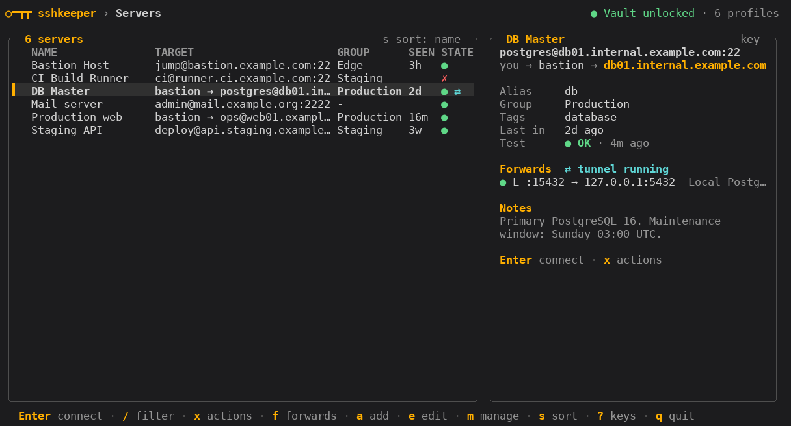
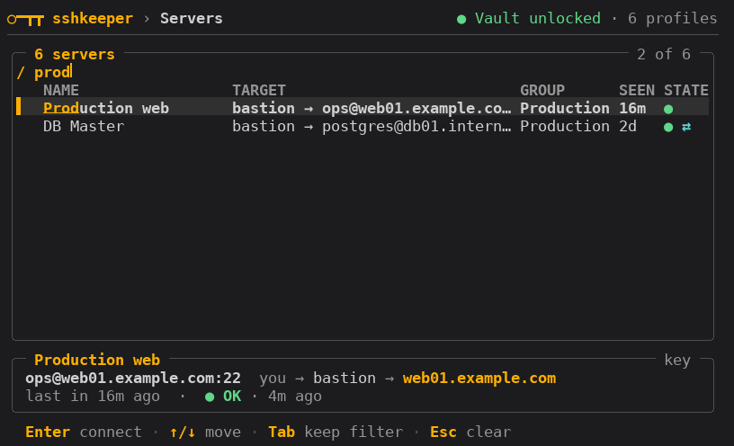
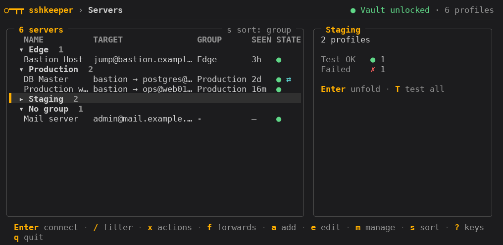
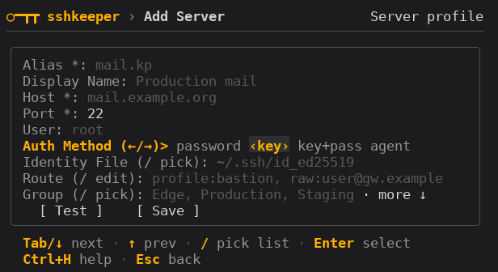
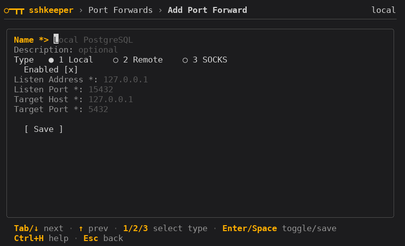
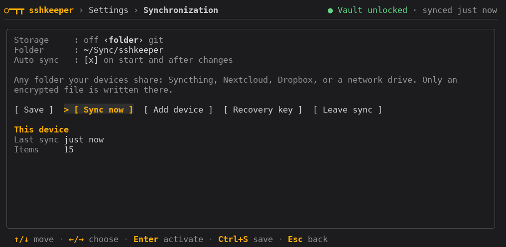
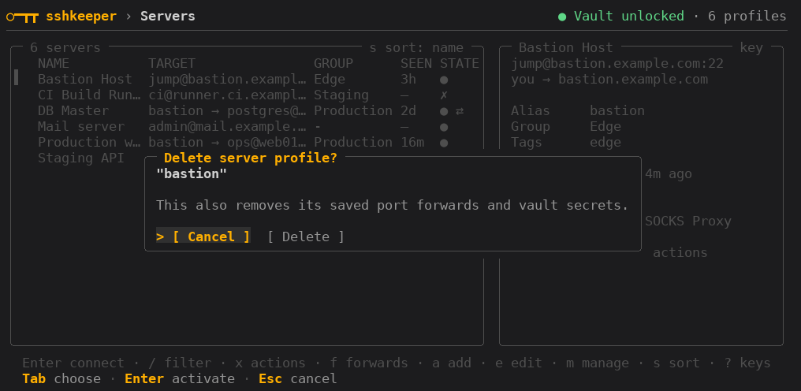

# sshkeeper — Руководство пользователя

Этот документ описывает sshkeeper v0.7.0: зашифрованную синхронизацию между
устройствами, а также живой фильтр, сортировки и группы, значки состояния,
панель подробностей и возврат в список после сессии из v0.6.

## Содержание

1. [Что такое sshkeeper](#что-такое-sshkeeper)
2. [Установка](#установка)
3. [Первый запуск](#первый-запуск)
4. [TUI — основной интерфейс](#tui--основной-интерфейс)
5. [Управление серверами](#управление-серверами)
6. [Маршруты и бастионы](#маршруты-и-бастионы)
7. [Port Forwards и Tunnels](#port-forwards-и-tunnels)
8. [Sessions — постоянные SSH-вкладки](#sessions--постоянные-ssh-вкладки)
9. [Синхронизация между устройствами](#синхронизация-между-устройствами)
10. [CLI команды](#cli-команды)
11. [Vault — хранилище секретов](#vault--хранилище-секретов)
12. [Сценарии использования](#сценарии-использования)
13. [Справка по клавишам](#справка-по-клавишам)

---

## Что такое sshkeeper

sshkeeper — это консольный менеджер SSH-подключений. Основные релизные платформы — Linux и macOS; Windows-сборка пока экспериментальная. Он хранит профили серверов, секреты (пароли, фразы от ключей) и запускает системный `ssh` с нужными опциями.

**Чем sshkeeper НЕ является:**
- Это не Ansible — он не настраивает серверы и не пушит файлы
- Это не замена SSH — он использует системный `/usr/bin/ssh`

**Что он делает:**
- Хранит профили серверов в локальной SQLite-базе
- Хранит пароли в зашифрованном vault (XChaCha20-Poly1305)
- Управляет маршрутами (бастионы, цепочки прыжков)
- Управляет port forwards (локальные, удалённые, SOCKS)
- Запускает туннели в фоне с отслеживанием PID
- Предоставляет TUI (текстовый интерфейс) и CLI

**Стек технологий:**
- Go 1.25+
- Bubble Tea (TUI framework)
- Cobra (CLI framework)
- SQLite (modernc.org/sqlite)
- XChaCha20-Poly1305 (шифрование vault)
- Argon2id (KDF для мастер-пароля)

**Исходники:**
- Основной публичный репозиторий: [github.com/mirivlad/sshkeeper](https://github.com/mirivlad/sshkeeper)
- Self-hosted зеркало: `git@git.mirv.top:mirivlad/sshkeeper`

---

## Установка

### Из исходников (основной способ)

```bash
git clone git@github.com:mirivlad/sshkeeper.git
cd sshkeeper
go build -o ~/.local/bin/sshkeeper .
```

Или через скрипт:

```bash
./build.sh          # сборка в bin/
./release.sh        # сборка релизных архивов в dist/
```

**Требования:** Go 1.25+ и системный OpenSSH. `tmux` необязателен, но рекомендуется для постоянных SSH-сессий; если его нет, весь интерфейс Sessions скрыт.

Статус платформ:

| Платформа | Статус | Примечание |
|-----------|--------|------------|
| Linux | Основная релизная платформа | Архивы `amd64`/`arm64`, а также `.deb` и `.rpm`. Пакеты рекомендуют, но не требуют `tmux` для Sessions. |
| macOS | Основная релизная платформа | Архивы `darwin/amd64` и `darwin/arm64`, нужен системный `ssh`; `brew install tmux` включает Sessions. Homebrew formula sshkeeper запланирована. |
| Windows | Experimental | Нужны Windows 10 1809+ и OpenSSH Client как `ssh.exe` в `PATH`. Запускается двойным щелчком из Проводника или из любой консоли; вход по паролю и по ключу с фразой вводит сохранённый секрет через псевдоконсоль Windows (ConPTY). В native Windows сборке Sessions скрыты; Linux-сборка внутри WSL может использовать `tmux`. |

На Windows OpenSSH Client можно установить через Windows Optional Features или PowerShell:

```powershell
Add-WindowsCapability -Online -Name OpenSSH.Client~~~~0.0.1.0
```

### Из релиза

Для Debian/Ubuntu (amd64):

```bash
sudo apt install ./sshkeeper_0.4.0-1_amd64.deb
```

Для Fedora/RHEL-подобных систем (x86_64):

```bash
sudo dnf install ./sshkeeper-0.4.0-1.x86_64.rpm
```

Для ARM64 публикуются `sshkeeper_0.4.0-1_arm64.deb` и
`sshkeeper-0.4.0-1.aarch64.rpm`. Архивный вариант остаётся доступен:

```bash
tar -xzf sshkeeper_v0.4.0_linux_amd64.tar.gz
sudo install -m 0755 sshkeeper_v0.4.0_linux_amd64/sshkeeper /usr/local/bin/sshkeeper
```

---

## Первый запуск

При первом запуске sshkeeper создаёт конфигурацию, базу данных и vault:

```bash
sshkeeper
```

Вы увидите приветствие и запрос на создание мастер-пароля:

```
Welcome to sshkeeper!
No vault found. Let's create one.

Create master password: ********
Repeat master password: ********

Vault created and unlocked for this command. You're ready to go!
```

**Важно:** запомните мастер-пароль. Без него секреты не восстановить.

После создания vault откроется главный экран TUI со списком серверов (пока пустым).

---

## TUI — основной интерфейс

Запуск TUI — просто `sshkeeper` без аргументов.

### Главный экран

```
○━┳┳ sshkeeper › Серверы                                          ● Хранилище открыто · профилей: 6
───────────────────────────────────────────────────────────────────────────────────────────────────
╭─ Серверов: 6 ───────────────────────── s сортировка: имя ─╮ ╭─ DB Master ───────────────── key ─╮
│   ИМЯ           ЦЕЛЬ                 ГРУППА     ВХОД СОСТ │ │ postgres@db01.internal.example.c… │
│   Bastion Host  jump@bastion.exampl… Edge       3ч   ●    │ │ вы → bastion → db01.internal.exa… │
│   CI Build Run… ci@runner.ci.exampl… Staging    —    ✗    │ │                                   │
│▌  DB Master     bastion → postgres@… Production 2д   ● ⇄  │ │ Псевдоним db                      │
│   Mail server   admin@mail.example.… -          —    ●    │ │ Группа    Production              │
│   Production w… bastion → ops@web01… Production 12м  ●    │ │ Теги      database                │
│   Staging API   deploy@api.staging.… Staging    3н   ●    │ │ Вход      2д назад                │
│                                                           │ │ Проверка  ● OK · только что       │
│                                                           │ │                                   │
│                                                           │ │ Пробросы  ⇄ туннель работает      │
│                                                           │ │ ● L :15432 → 127.0.0.1:5432  Loc… │
│                                                           │ │                                   │
╰───────────────────────────────────────────────────────────╯ ╰───────────────────────────────────╯
  Enter подключиться · / фильтр · x действия · f пробросы · a добавить · e изменить · m управление
  s сортировка · ? клавиши · q выход
```

Слева список профилей, справа подробности выбранного: цель, маршрут цепочкой
(`вы → bastion → хост`), группа, теги, время последнего входа, результат
последней проверки, сохранённые пробросы с их состоянием, открытые tmux-сессии
и заметки.

Интерфейс адаптируется к ширине терминала:

- от 100 столбцов список и подробности показаны в двух панелях;
- от 70 до 99 столбцов под списком остаётся компактная полоса с главным;
- от 60 до 69 столбцов остаётся компактная таблица без цели и подробностей;
- минимальный поддерживаемый размер — `60x16`; ниже показывается сообщение о необходимом размере.

Курсор обозначен полоской `▌`, отмеченные пробелом профили — галочкой `✓`.
Цвета адаптируются к светлой и тёмной теме терминала и полностью отключаются
при `NO_COLOR`. Для терминалов и шрифтов без символов псевдографики задайте
`glyphs = "ascii"` в секции `[ui]` файла `~/.config/sshkeeper/config.toml`
или переменную окружения `SSHKEEPER_ASCII=1`.







**Столбцы:**

| Столбец | Описание |
|---------|----------|
| ИМЯ | Отображаемое имя или псевдоним |
| ЦЕЛЬ | `user@host:port`, при маршруте — цепочка бастионов |
| ГРУППА | Группа сервера |
| ВХОД | Сколько прошло с последнего подключения: `12м`, `3ч`, `2д`, `3н` |
| СОСТ | Состояние: результат проверки, туннель, tmux-сессия |

**Значки состояния:**

| Значок | Значение |
|--------|----------|
| `●` | Последняя проверка прошла |
| `✗` | Последняя проверка не прошла (причина — в подробностях) |
| `·` | Ещё не проверялся |
| `◌` | Идёт проверка |
| `⇄` | Для сервера работает фоновый туннель |
| `▣` | Открыта tmux-сессия |

Туннели и сессии перечитываются каждые 10 секунд, поэтому значки появляются и
для туннелей, запущенных из другого процесса sshkeeper.

**Клавиши главного экрана.** В списке нет текстового поля, поэтому основные
действия доступны одной буквой; прежние сочетания с `Ctrl` тоже работают.

| Клавиша | Действие |
|---------|----------|
| `↑/↓`, `j/k` | Перемещение по списку; `g`/`G` — к первому/последнему |
| `Enter` | Подключиться к серверу |
| `/` или `Ctrl+F` | Живой фильтр |
| `a` / `Ctrl+A` | Добавить сервер |
| `e` / `Ctrl+E` | Редактировать сервер |
| `d` / `Ctrl+D` | Удалить сервер (с подтверждением) |
| `t` / `Ctrl+T` | Проверить подключение |
| `T` | Проверить все видимые (или отмеченные) серверы параллельно |
| `x` / `Ctrl+X` | Действия выбранного сервера |
| `f` / `Ctrl+W` | Правила проброса портов |
| `r` / `Ctrl+R` | Выполнить шаблон команды |
| `s` | Сортировка: имя → недавние → группы |
| `←/→` | Свернуть/развернуть группу (при сортировке по группам) |
| `Space` / `Ins` | Отметить/снять отметку |
| `m` | Меню управления, включая настройки языка |
| `?` | Краткая справка по клавишам |
| `Ctrl+H` | Полная справка по приложению |
| `q` / `Ctrl+Q` | Выход |

`Ctrl+Q` работает глобально. Если активная форма содержит несохранённые
изменения, сначала открывается безопасное подтверждение с выбранным Cancel.

**Живой фильтр.** `/` открывает строку фильтра прямо в списке. Список
сужается с каждым символом, совпавшие буквы подсвечиваются, курсор встаёт на
лучшее совпадение. Выше всего ранжируются совпадения в имени, затем в
псевдониме, затем нечёткие (от трёх символов: `bst` найдёт `Bastion`), затем
любые метаданные: хост, пользователь, группа, теги, заметки, узлы маршрута,
имена и порты пробросов. `Enter` сразу подключает к выделенному серверу,
`Tab` оставляет фильтр и возвращает к списку, `Esc` сбрасывает фильтр.

**Сортировка и группы.** `s` переключает порядок: по имени, по последнему
подключению, по группам. Выбор сохраняется как `ui.sort`. В режиме групп
перед каждой группой стоит заголовок с числом профилей; `Enter`, `Space`,
`←` и `→` сворачивают и разворачивают группу, а панель подробностей
показывает сводку по группе.

**Возврат после сессии.** После чистого выхода из ssh sshkeeper сразу
возвращается в список, курсор остаётся на том же сервере, а вверху видно
`← Возврат из <сервер> · 42 мин`. Если подключение завершилось ошибкой, вывод
ssh остаётся на экране до нажатия Enter. Уведомления об успехе гаснут сами
через пять секунд.

### Быстрая справка по клавишам

Нажмите `?` на экране списка или менеджера. В текстовом поле символ `?`
остаётся обычным вводом. `Ctrl+H` открывает полную справку также из форм.
Краткая справка перечисляет клавиши главного экрана и форм из таблицы выше.

### Полная справка по приложению

Нажмите `Ctrl+H` на любом экране. Это полная документация по sshkeeper:
навигация, клавиши списка, действия сервера, меню управления, значки
состояния, маршруты, пробросы и туннели.

> **Про терминалы.** `Ctrl+H` — это управляющий символ BS (0x08), а Backspace в
> xterm и большинстве современных эмуляторов шлёт DEL (0x7F), поэтому справка и
> редактирование текста не конфликтуют. Если ваш терминал настроен отправлять BS
> по Backspace, различить их невозможно: Backspace начнёт открывать справку.
> В этом случае переключите терминал на DEL (в xterm — `backarrowKey: false`).

**Навигация по полной справке:**

| Клавиша | Действие |
|---------|----------|
| `↑/↓` | Прокрутка |
| `PgUp/PgDn` | Прокрутка по странице |
| `q` / `Esc` / `Enter` | Закрыть справку |

---

## Управление серверами

### Добавление сервера

1. Нажмите `a` (или `Ctrl+A`) на главном экране. Если серверов ещё нет, стартовый экран предложит также `i` — импорт хостов из `~/.ssh/config`.
2. Заполните поля:

```
Add Server

  Alias *:            mail.kp
  Display Name:       Production mail
  Host *:             mail.example.org
  Port *:             22
  User:               root
  Auth Method (←/→):    password ‹key› key+pass agent
  Identity File:      ~/.ssh/id_ed25519
  Route:              profile:bastion
  Group:              KP
  Notes:              Main mail server
  Startup Command:    tmux attach -t ops
  Tags:               prod, mail

  [ Test ]  [ Save ]

  Tab/↓ next · ↑ prev · / pick list · Enter select · Ctrl+H help · Esc back
```

Поля с `*` обязательны. Порты принимают только десятичные значения от `1` до
`65535`; ошибочный текст остаётся в поле рядом с понятным сообщением. На
маленьком экране форма показывает окно полей вокруг текущего фокуса, сохраняя
кнопки и подсказку видимыми.



**Навигация по форме:**

| Клавиша | Действие |
|---------|----------|
| `Tab` или `↓` | Следующее поле |
| `Shift+Tab` или `↑` | Предыдущее поле |
| `←/→` на Auth Method | Переключить password / key / key+pass / agent (`/` открывает список) |
| `/` на Identity File | Выбрать приватный ключ из `~/.ssh` |
| `/` на Route | Открыть редактор цепочки бастионов |
| `/` на Group | Выбрать существующую группу |
| `/` на Startup Command | Скопировать команду из глобального шаблона |
| `/` на Tags | Multi-select существующих тегов; новые можно ввести вручную |
| `Enter` на Test | Проверить подключение |
| `Enter` на Save | Сохранить |
| `Esc` | Назад; при изменённых данных сначала запросить подтверждение сброса |

### Редактирование сервера

1. Выберите сервер стрелками
2. Нажмите `e` (или `Ctrl+E`)
3. Отредактируйте поля
4. Нажмите `Enter` на Save

### Удаление сервера

1. Выберите сервер стрелками
2. Нажмите `d` (или `Ctrl+X` → "Delete")
3. Диалог по умолчанию выделяет **Cancel**. Нажмите `Tab`, затем `Enter`, чтобы удалить; `Esc` отменяет операцию. Быстрые клавиши `Y`/`N` также поддерживаются.

Диалог открывается по центру поверх затемнённого экрана, называет точный
профиль и предупреждает, что вместе с ним удаляются сохранённые forwards и
секреты vault.

### Тест подключения

1. Выберите сервер стрелками
2. Нажмите `t` (или `Ctrl+X` → "Test connection")
3. Результат появится в столбце СОСТ (`●` или `✗`), причина ошибки — в подробностях

`T` проверяет все видимые серверы (или только отмеченные пробелом) параллельно,
не больше шести одновременно, и показывает сводку.

### Поиск

Нажмите `/` (или `Ctrl+F`) и начните вводить — это живой фильтр, описанный в
разделе «Главный экран». `Enter` подключает к выделенному серверу, `Tab`
оставляет фильтр, `Esc` сбрасывает его.

---

## Маршруты и бастионы

### Прямое подключение

Сервер подключается напрямую:

```
ROUTE:   ● direct → root@web.example.org:22
```

### Через бастион

Сервер доступен через один jump host:

```
ROUTE:   → bastion → root@internal.web:22
```

### Цепочка прыжков

Сервер доступен через несколько jump hosts:

```
ROUTE:   ⇒ bastion → dmz-gw → … → root@secure.internal:22
```

### Настройка маршрута

**Через TUI:**
1. Добавьте/редактируйте сервер или выберите `Ctrl+X` → **Route**.
2. Нажмите `/` на поле Route — откроется список существующих профилей.
3. `Enter` добавляет выбранный профиль в ordered chain, `x`/Delete удаляет hop, `[`/`]` меняет порядок.
4. Для произвольной OpenSSH-цели оставьте escape hatch в поле: `raw:user@bastion.example.com:2222`.

Ссылка на профиль хранится по стабильному ID. Переименование alias бастиона не
ломает зависимые маршруты, а удалить используемый бастион sshkeeper не даст,
пока он присутствует в route других серверов. Во время подключения profile-hop
разрешается из БД sshkeeper; отдельная запись с тем же alias в `~/.ssh/config`
не требуется.

**Через CLI:**

```bash
sshkeeper route set web --jumps bastion
sshkeeper route set prod --jumps bastion,dmz-gw
sshkeeper route show web
sshkeeper route clear web
```

---

## Port Forwards и Tunnels

### Ключевое различие

- **Port Forward** — сохранённое правило проброса порта. Просто конфигурация, не запускает процесс.
- **Tunnel** — запущенный SSH-процесс, который активирует один или несколько forwards.

Аналогия: forward — это рецепт, tunnel — это готовое блюдо.

### Типы forwards

| Тип | Описание | Пример |
|-----|----------|--------|
| **Local** | Порт на вашей машине → сервис за SSH-сервером | Локальный 5432 → удалённый PostgreSQL |
| **Remote** | Порт на SSH-сервере → сервис на вашей машине | Удалённый 8080 → локальный dev-сервер |
| **SOCKS** | Локальный SOCKS-прокси через SSH | Браузер → SOCKS → интернет через SSH-сервер |

### Управление forwards через TUI

Снимки и текстовые схемы ниже показывают английские подписи; при выбранном
русском языке названия действий переведены, но клавиши и значения полей те же.

1. Выберите сервер на главном экране
2. Нажмите `x` (`Ctrl+X`) → **Правила проброса портов** или сразу `f` (`Ctrl+W`)
3. Откроется список forwards:

```
Port Forwards — web

  NAME                 TYPE    LISTEN               TARGET               ON
> Local PostgreSQL     local   127.0.0.1:15432      127.0.0.1:5432       yes

Selected
  Port 127.0.0.1:15432 on this machine will be forwarded through web to 127.0.0.1:5432.
  ssh -L 127.0.0.1:15432:127.0.0.1:5432

  Ctrl+B start in background · Ctrl+X start modes · Ctrl+A add · Space enable/disable · Esc back
```

Строки и пояснение выбранного forward сокращаются по экранным ячейкам, а не
по байтам, поэтому кириллица, CJK и emoji не ломают границы таблицы.

**Действия:**

| Клавиша | Действие |
|---------|----------|
| `Ctrl+A` | Добавить forward |
| `Enter` или `Ctrl+E` | Редактировать выбранный |
| `Space` | Включить/выключить правило |
| `Ctrl+B` | Запустить фоновый туннель с включёнными правилами |
| `Ctrl+X` | Выбрать режим запуска для этого сервера |
| `Ctrl+D` | Удалить (с подтверждением) |
| `Esc` | Назад |

### Добавление forward

1. Нажмите `Ctrl+A` на экране forwards
2. Выберите тип (1/2/3 или Tab):

```
Add Port Forward

  Name *:             Local PostgreSQL
  Description:        optional

  Type  ● 1 Local   ○ 2 Remote   ○ 3 SOCKS

  Listen Address *:   127.0.0.1
  Listen Port *:      15432
  Target Host *:      127.0.0.1
  Target Port *:      5432

  Preview
  -L 127.0.0.1:15432:127.0.0.1:5432
  -o ExitOnForwardFailure=yes

  [ Save ]

  Tab/↓: next | ↑: prev | 1/2/3: select type | Enter: save | Esc: back
```

Цифры `1`/`2`/`3` переключают тип только когда фокус находится на селекторе
типа. В полях адреса и порта они вводятся как обычный текст.



**Поля зависят от типа:**

| Тип | Поля |
|-----|------|
| Local | Listen Address, Listen Port, Target Host, Target Port |
| Remote | Remote Listen Addr, Remote Listen Port, Local Target Host, Local Target Port |
| SOCKS | Listen Address, Listen Port (target поля скрыты) |

**По умолчанию Listen Address = `127.0.0.1`** (только локальный доступ). Если введёте `0.0.0.0`, появится предупреждение.

После сохранения TUI возвращает к списку и подсказывает следующий шаг:
`Ctrl+B` запускает фоновый туннель, `Ctrl+X` открывает все режимы. Сохранённое
правило само по себе порт не открывает.

### Запуск туннеля

**Через TUI:**
1. Выберите сервер и убедитесь, что у него есть хотя бы одно включённое правило
2. В списке forwards нажмите `Ctrl+B` для фонового запуска или `Ctrl+X` для выбора режима. С главного экрана меню режимов открывается через `Ctrl+X`:
   - **Подключиться с пробросом** — SSH-сессия + все включённые правила
   - **Запустить туннель без оболочки** — процесс на переднем плане
   - **Запустить фоновый туннель** — процесс в фоне с PID

Меню показывает сервер и число включённых правил. Недоступный режим помечается
и объясняет причину: нет включённых правил или фоновый запуск несовместим с
паролем/ключом с passphrase. Запуск в фоне не закрывает TUI: сообщение об
успехе с PID либо ошибке остаётся на экране. Для проверки процесса откройте
`m` → **Running tunnels**. Режим без shell на переднем плане останавливается
`Ctrl+C`, после чего TUI возвращается по Enter.

**Через CLI:**

```bash
# SSH-сессия с туннелями
sshkeeper tunnel web

# Только туннель (foreground)
sshkeeper tunnel web --forward-only

# Туннель в фоне
sshkeeper tunnel web --background
```

Все режимы туннелей в TUI, а также CLI `--forward-only`/`--background`, требуют
хотя бы один включённый forward. Фоновый туннель
запускается как `ssh -N` и сейчас поддерживает только `key` или `agent` auth. Для
`password`/`key_passphrase` используйте foreground-режим (`sshkeeper tunnel web`
или `--forward-only`), чтобы sshkeeper мог обработать PTY prompt и передать
секрет из vault.

### Управление туннелями

**Через TUI:**
1. Нажмите `m` → **Running tunnels**
2. Список запущенных туннелей:

```
Tunnel Manager

  Tunnel to web              PID 12345    running   2m30s
  Tunnel to prod             PID 12346    running   1m15s

  Ctrl+D stop · Ctrl+R refresh · Esc back
```

**Через CLI:**

```bash
sshkeeper tunnel list
sshkeeper tunnel stop <id>
sshkeeper tunnel stop-all
```

---

## Sessions — постоянные SSH-вкладки

Sessions — необязательный слой поверх системного `tmux`: он позволяет держать несколько SSH-подключений в одном терминальном workspace.

Если `tmux` найден в `PATH`, у сервера появляется **Open in session**, а в меню `m` появляется **Sessions**. Если `tmux` отсутствует, оба пункта полностью скрыты и обычный `Connect` работает как раньше.

Экран Sessions показывает только tmux-окна, созданные sshkeeper. `Enter` подключается к выбранной вкладке, `Ctrl+D` закрывает её после подтверждения, `Ctrl+R` обновляет список.

Вне tmux sshkeeper использует отдельную tmux-сессию `sshkeeper`. Если sshkeeper уже запущен внутри tmux, новые SSH-вкладки создаются в текущей tmux-сессии без вложенного клиента. Обычное отсоединение tmux возвращает к sshkeeper, а SSH-процессы продолжают работать.

Для `key` и `agent` отдельного разблокирования vault не требуется. При `password` или `key_passphrase` master password запрашивается внутри новой вкладки; секреты не передаются через argv, environment или временные shell-скрипты.

На Linux установите пакет `tmux` через пакетный менеджер дистрибутива. На macOS — `brew install tmux`. В `.deb`/`.rpm` `tmux` указан как рекомендация, а не обязательная зависимость. Native Windows-сборка Sessions не показывает; этот режим доступен при запуске Linux-сборки sshkeeper внутри WSL с установленным там `tmux`.

---

## Синхронизация между устройствами

sshkeeper поддерживает устройства в согласии через один файл со сквозным
шифрованием. Синхронизируются профили (с маршрутами, группами, тегами и
заметками), пробросы портов, шаблоны команд, группы и теги, секреты хранилища
и файлы закрытых ключей, на которые ссылаются профили. Сведения конкретного
устройства — последний вход, последняя проверка, запущенные туннели, язык и
сортировка — остаются на нём.



### Где хранится файл

Выбирается в `m` → **Настройки** → **Синхронизация**. Форма меняется в
зависимости от выбора:

- **Папка** — любая общая папка: Syncthing, Nextcloud, Dropbox или сетевой
  диск. Копии-конфликты, которые создают эти программы, объединяются.
- **Git** — приватный репозиторий, в который вы делаете push своими учётными
  данными. Файл лежит в отдельной ветке (по умолчанию `sshkeeper`) и не
  затрагивает остальное содержимое репозитория. Git не задаёт вопросов изнутри
  sshkeeper: используйте SSH-ключ, загруженный в агент, или credential helper.

### Подключение устройств

1. На первом устройстве выберите хранилище и **Создать синхронизацию**.
   sshkeeper покажет ключ восстановления — храните его офлайн. Он нужен,
   только если потеряны все устройства.
2. Если оба устройства могут быть включены одновременно, выберите
   **Добавить устройство** и подтвердите мастер-пароль. Появится шестизначный
   код, он действует 10 минут.
3. Для dual-boot или устройства, которое нельзя включить одновременно со
   старым, выберите **Добавить позже (24 ч)**. sshkeeper покажет одноразовый
   высокоэнтропийный код **SKP1-...**, действующий 24 часа. Если папку
   хранилища синхронизирует отдельная программа, сначала дождитесь её
   синхронизации; после этого старую ОС можно выключить. Её мастер-пароль на
   новом устройстве не нужен.
4. На новом устройстве выберите то же хранилище и **Подключить это
   устройство**. Можно ввести шестизначный код + мастер-пароль старого
   устройства, офлайн-код **SKP1-...** без пароля или ключ восстановления.

С включённой **автосинхронизацией** TUI синхронизируется при запуске и через
три секунды после каждого изменения. В шапке виден значок `⇅` со временем
последней синхронизации или ошибкой. Если с других устройств пришли изменения,
список обновится и появится уведомление.

Из командной строки:

```bash
sshkeeper sync setup folder ~/Sync/sshkeeper   # или: sync setup git <url> [--branch ...]
sshkeeper sync init                            # первое устройство
sshkeeper sync add-device                      # шестизначный код на 10 минут
sshkeeper sync add-device --offline            # одноразовый SKP1-код на 24 часа
sshkeeper sync join                            # подключить новое устройство
sshkeeper sync                                 # синхронизировать сейчас
sshkeeper sync status                          # хранилище и последний результат
sshkeeper sync recovery-key                    # показать ключ восстановления
sshkeeper sync leave                           # отключить устройство, данные остаются
```

### Почему секреты не утекут

- Всё передаётся внутри одного файла, зашифрованного XChaCha20-Poly1305
  случайным 256-битным ключом синхронизации. Хранилище видит только метку
  формата и отпечаток ключа — ни имён, ни хостов, ни даже числа секретов.
- Ключ синхронизации хранится только в хранилище секретов каждого устройства.
  У украденного файла нет пароля, который можно подобрать.
- Шестизначный код сам по себе бесполезен: ключ синхронизации зашифрован кодом
  вместе с мастер-паролем устройства, показавшего код (Argon2id). Код истекает
  через 10 минут и удаляется после использования.
- Для отложенного подключения используется случайный 128-битный одноразовый
  код **SKP1-...**. Мастер-пароль старого устройства ему не нужен, а срок
  24 часа позволяет спокойно перезагрузить dual-boot машину в другую ОС.
  После подключения код удаляется. В git pairing хранится в отдельной
  временной ветке, которая затем удаляется и не попадает в историю синхронизации.
- Синхронизация не запускается при заблокированном хранилище, поэтому
  недоступные секреты никогда не принимаются за удалённые.
- Пути используемых SSH-ключей в синхронизации переносимы между ОС. Например,
  `/home/alice/.ssh/id_ed25519` на Windows превращается в локальный
  `%USERPROFILE%\.ssh\id_ed25519`, а не остаётся Linux-путём.
- Существующий файл ключа никогда не перезаписывается. Если на устройстве по
  тому же локальному пути уже лежит другой ключ, он остаётся, о нём выводится
  предупреждение, и он не уходит на другие устройства.
- Изменения объединяются по каждому объекту по последней правке; удаления тоже
  синхронизируются.

---

## CLI команды

### Серверы

```bash
# Добавление
sshkeeper add web --host 10.0.0.10 --user deploy --auth key
sshkeeper add prod --host 10.0.0.20 --user root --auth password
sshkeeper add bastion --host bastion.example.org --user admin --auth key_passphrase --identity-file ~/.ssh/id_rsa

# Интерактивный режим
sshkeeper add

# Просмотр
sshkeeper list
sshkeeper show web
sshkeeper search prod

# Подключение
sshkeeper connect web
sshkeeper c web          # короткая форма

# Выполнение команды
sshkeeper run web "uptime"

# Тест подключения
sshkeeper test web

# Редактирование
sshkeeper edit web --tags prod,web --startup-command "tmux attach -t ops"

# Удаление
sshkeeper delete web
```

### Маршруты

```bash
sshkeeper route set web --jumps bastion
sshkeeper route set prod --jumps bastion,dmz-gw
sshkeeper route show web
sshkeeper route clear web
```

### Port Forwards

```bash
# Добавление
sshkeeper forward add web --name "Local PostgreSQL" --type local --local-port 15432 --remote-addr 127.0.0.1 --remote-port 5432
sshkeeper forward add bastion --name "SOCKS Proxy" --type dynamic --local-port 1080

# Список
sshkeeper forward list web

# Включить/выключить
sshkeeper forward edit 1 --enabled=false

# Удаление
sshkeeper forward delete web 1
```

### Tunnels

```bash
sshkeeper tunnel web                    # SSH + туннели
sshkeeper tunnel web --forward-only     # Только туннель
sshkeeper tunnel web --background       # Фоновый туннель
sshkeeper tunnel list                   # Список туннелей
sshkeeper tunnel stop <id>              # Остановить
sshkeeper tunnel stop-all               # Остановить все tracked туннели
```

### Группы и шаблоны

```bash
sshkeeper group list
sshkeeper group rename old new
sshkeeper group delete name

sshkeeper template list
sshkeeper template add uptime "uptime"
sshkeeper template delete uptime
sshkeeper run-template web uptime
```

### Vault

```bash
sshkeeper vault status
sshkeeper vault unlock
sshkeeper vault list
sshkeeper vault delete web ssh_password
sshkeeper vault change-password
```

### Импорт/Экспорт

```bash
sshkeeper import              # Импорт из ~/.ssh/config
sshkeeper export              # Экспорт в stdout
```

---

## Vault — хранилище секретов

Vault хранит SSH-пароли и фразы от ключей в зашифрованном виде.

**Шифрование:** XChaCha20-Poly1305, KDF: Argon2id (64 MiB, 3 iterations)

**Когда нужен мастер-пароль:**
- `connect`, `c` — для подключения с password/key_passphrase аутентификацией
- `run`, `run-template` — для выполнения команд
- `test` — для тестирования
- `edit`, `delete` — для редактирования секретов
- `vault` команды

**Когда НЕ нужен:**
- `list`, `show`, `search` — только метаданные
- `add` с auth=key или auth=agent
- `tunnel list`, `tunnel stop`, `tunnel stop-all`
- `tunnel <alias> --background`
- `export`, `ssh-config`

---

## Сценарии использования

### Сценарий 1: Подключение к серверу через бастион

```bash
# 1. Добавляем бастион
sshkeeper add bastion --host bastion.example.org --user admin --auth key

# 2. Добавляем внутренний сервер с маршрутом через бастион
sshkeeper add web --host 10.0.0.10 --user deploy --auth key
sshkeeper route set web --jumps bastion

# 3. Подключаемся
sshkeeper connect web
# Автоматически: ssh -J bastion deploy@10.0.0.10
```

### Сценарий 2: Локальный доступ к удалённой базе данных

```bash
# 1. Добавляем сервер
sshkeeper add db --host db.internal --user postgres --auth key

# 2. Создаём forward
sshkeeper forward add db --name "PostgreSQL" --type local --local-port 15432 --remote-addr 127.0.0.1 --remote-port 5432

# 3. Запускаем туннель в фоне
sshkeeper tunnel db --background
# ✓ Tunnel started [12345] PID 67890 → db

# 4. Подключаемся локально
psql -h 127.0.0.1 -p 15432 -U myuser mydb

# 5. Когда не нужен — останавливаем
sshkeeper tunnel stop 12345
```

### Сценарий 3: SOCKS-прокси для браузера

```bash
# 1. Добавляем сервер
sshkeeper add jump --host jump.example.org --user me --auth key

# 2. Создаём SOCKS forward
sshkeeper forward add jump --name "SOCKS" --type dynamic --local-port 1080

# 3. Запускаем туннель
sshkeeper tunnel jump --background

# 4. Настраиваем браузер: SOCKS5 127.0.0.1:1080
```

### Сценарий 4: Цепочка прыжков

```bash
# Сервер за двумя бастионами
sshkeeper add secure --host 10.10.10.10 --user root --auth key
sshkeeper route set secure --jumps bastion,dmz-gw

# Подключение
sshkeeper connect secure
# Автоматически: ssh -J bastion,dmz-gw root@10.10.10.10
```

### Сценарий 5: Групповые операции

```bash
# В TUI: отметить несколько серверов пробелом, затем:
# r (или Ctrl+R) → выбрать шаблон
# Команда выполнится на всех выбранных серверах
```

---

## Справка по клавишам

### Главный экран

| Клавиша | Действие |
|---------|----------|
| `Enter` | Подключиться к серверу |
| `/` / `Ctrl+F` | Живой фильтр |
| `j`/`k`, `g`/`G` | Вниз/вверх, к первому/последнему |
| `a` / `Ctrl+A` | Добавить сервер |
| `e` / `Ctrl+E` | Редактировать сервер |
| `d` / `Ctrl+D` | Удалить сервер |
| `t` / `Ctrl+T` | Проверить подключение |
| `T` | Проверить все видимые или отмеченные |
| `x` / `Ctrl+X` | Действия выбранного сервера |
| `f` / `Ctrl+W` | Правила проброса портов |
| `r` / `Ctrl+R` | Выполнить шаблон команды |
| `s` | Сортировка: имя / недавние / группы |
| `←/→` | Свернуть/развернуть группу |
| `Space` / `Ins` | Отметить/снять отметку |
| `i` | Импорт из `~/.ssh/config` (только на стартовом экране) |
| `m` | Глобальное меню Manage |
| `?` | Краткая справка по клавишам |
| `Ctrl+H` | Полная справка по приложению |
| `q` / `Ctrl+Q` | Выход |

### Действия сервера (Ctrl+X)

Правило проброса — сохранённая настройка. Туннель — запущенный процесс,
использующий включённые правила. SSH-маршрут определяет путь до самого
SSH-сервера через промежуточные узлы, а не адрес сервиса назначения.

| Действие | Описание |
|----------|----------|
| Подключиться | Стандартное SSH-подключение |
| Правила проброса портов | Добавить и настроить сохранённые правила |
| Подключиться с пробросом | SSH + включённые правила |
| Запустить туннель без оболочки | Процесс с пробросами на переднем плане |
| Запустить фоновый туннель | Отдельный процесс с пробросами и PID |
| SSH-маршрут | Путь до сервера напрямую или через бастионы |
| Test connection | Проверка подключения |
| Edit | Редактирование сервера |
| Delete | Удаление (с подтверждением) |

### Manage (`m`)

| Действие | Описание |
|----------|----------|
| Groups | Создание, переименование и удаление групп с количеством серверов |
| Tags | Управление тегами |
| Command templates | Глобальные шаблоны команд |
| Running tunnels | Список и остановка фоновых туннелей |
| Settings / Настройки | Язык интерфейса (System / Русский / English) и синхронизация |
| Import SSH config | Импорт из `~/.ssh/config` |
| Export | Выход в терминал и печать экспорта |
| Vault: lock | Заблокировать vault в текущем процессе |
| Vault: change password | Выход в терминал и смена master password |

Язык TUI и пользовательских сообщений CLI по умолчанию выбирается из локали
системы (`LC_ALL` → `LC_MESSAGES` → `LANG` на Unix). Для неподдерживаемых
локалей используется английский. В `m` → **Настройки** → **Язык** можно выбрать
**Системный**, **Русский** или **English**; изменение применяется сразу и
сохраняется как `ui.language` в `~/.config/sshkeeper/config.toml`.
Команды, флаги, алиасы серверов и параметры SSH остаются на исходном языке.

### Формы (добавление/редактирование)

| Клавиша | Действие |
|---------|----------|
| `Tab` / `↓` | Следующее поле |
| `Shift+Tab` / `↑` | Предыдущее поле |
| `←/→` на Auth Method | Переключить способ входа |
| `/` | Открыть picker/editor для Auth, key, Route, Group, Startup Command или Tags |
| `Enter` | Действие / переход |
| `Esc` | Назад / отмена |

### Список forwards

| Клавиша | Действие |
|---------|----------|
| `↑/↓` | Навигация |
| `Ctrl+A` | Добавить |
| `Enter` / `Ctrl+E` | Редактировать |
| `Ctrl+D` | Удалить (с подтверждением) |
| `Esc` | Назад |

### Список туннелей

| Клавиша | Действие |
|---------|----------|
| `Ctrl+D` / `s` | Остановить туннель |
| `Ctrl+R` / `r` | Обновить список |
| `Esc` | Назад |

### Диалог подтверждения

| Клавиша | Действие |
|---------|----------|
| `Tab` / `Shift+Tab` / `←` / `→` | Переключить Cancel/действие |
| `Enter` | Выполнить выделенный вариант; по умолчанию это Cancel |
| `Y` | Подтвердить действие |
| `Esc` / `N` | Отменить |



---

## Расположение данных

| Данные | Путь |
|--------|------|
| Конфиг | `~/.config/sshkeeper/config.toml` |
| База данных | `~/.local/share/sshkeeper/sshkeeper.db` |
| Vault | `~/.local/share/sshkeeper/vault.bin` |
| Кэш git-синхронизации | `~/.local/share/sshkeeper/sync-git/` |
| Туннели | `~/.local/share/sshkeeper/tunnels.json` |
| OpenSSH config | `~/.ssh/config.d/sshkeeper.conf` |

Если заданы `XDG_CONFIG_HOME` или `XDG_DATA_HOME`, данные хранятся в соответствующих поддиректориях.

---

## Сборка и тестирование

```bash
# Тесты
go test ./...

# Сборка
go build -o bin/sshkeeper .

# Проверка релизной кросс-сборки
make release-check

# Или через скрипты
./build.sh          # сборка в bin/
./release.sh        # релизные архивы в dist/
```

## Лицензия

MIT. См. [LICENSE](LICENSE).
